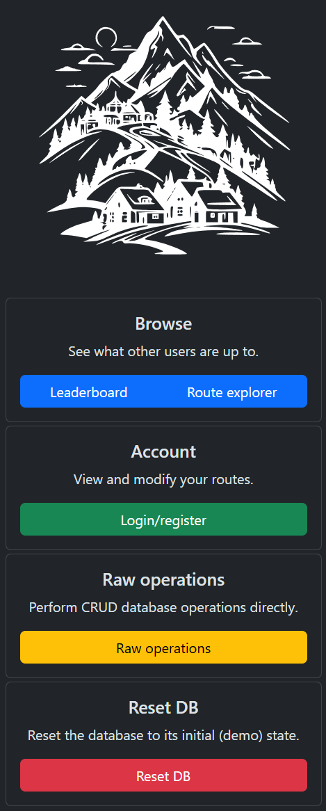
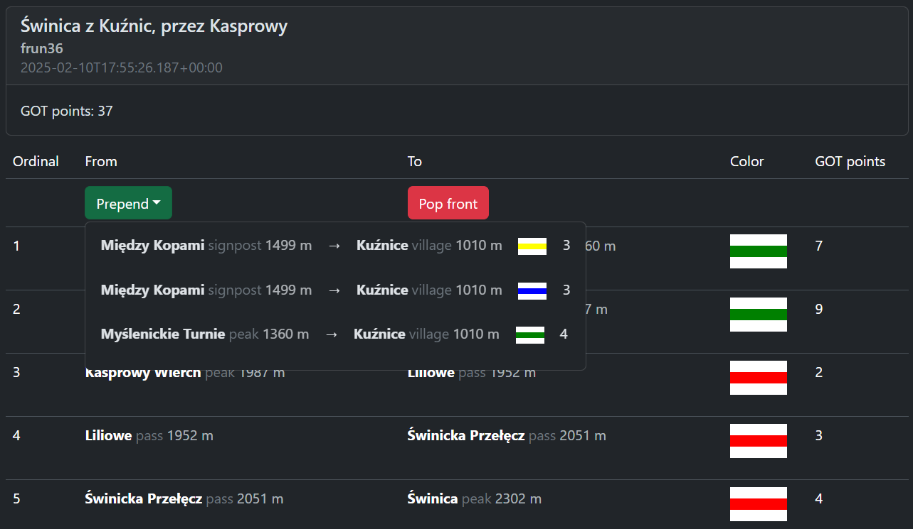

# Mountains Database

## Overview
The code of my final project for an introductory Databases (Bazy Danych 1) course at AGH - an app allowing users to plan, share and view routes in the Polish Tatra mountains (only aroud Hala Gąsienicowa).

  

## Features
- Browsing the leaderboard and profiles of other users
- Viewing other users' routes
- Creating an account, and adding your own routes in a friendly Route editor
- Raw operations on the database, incl. reset to example data

## Implementation overview

### `database`
Contains the DDL files for recreating the database, along with some sample data (`tatra.sql`).

### `api`
Contains a Spring Boot REST API for communicating with the database. It contains endpoints enabling CRUD operation on each table in the database (generic) and those responsible for each functionality of the app.

### `app`
A React TypeScript application, enabling easy access to all aforementioned features. I am especially happy with how the route editor turned out:

A more detailed description of the app, with a strong focus on the database part, can be found in `bd1-mountains.pdf` (in Polish).

